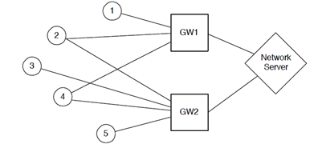

# IotProject - LoraWAN Network

This repository contains the solution to project number 2 of the Politecnico di Milano course Internet of things class 2022-2023. 

## Description 

The aim of this project is to implement and showcase a network architecture similar to LoraWAN within the TinyOS environment with the following topology:

  

Sensor nodes 1,2,3,4,5 periodically transmit random data that are received by one or more gateways. These two forward the messages to the network server. The server saves the data received and send back an ack packet. If the ack is not received by the sensor within 1s, the message is re-transmitted. 

## Implementation

The project was executed in several steps, each focusing on different aspects of the implementation. The key platforms used throughout the project are:
1. `TinyOS` with TOSSIM simulator for logical implementation: in this phase we were able to logically implement the essential components, including node, communication, ack and duplicated messages management.
2. `Node-RED` for MQTT transmission: we integrate Node-RED to establish a MQTT-based connection between the simulated Network Server and an external environment to send sensor nodes data.
3. `Thingspeak` for graphical visualization of sensor data: it enables the real-time display of collected information sent by Node-RED on a public channel

## How to run

To ensure optimal visualization, it is recommended to clear the ThingSpeak graphs by following these steps. You can utilize the <a href="https://www.postman.com/">POSTMAN </a> site to experiment with HTTP requests via the ThingSpeak RESTful API. The HTTP request format for deletion is as follows:

	DELETE https://api.thingspeak.com/channels/4/feeds.json
       api_key=XXXXXXXXXXXXXXXX

1. In POSTMAN, select DELETE from the drop-down list of HTTP verbs.
2. In the address bar, enter https://api.thingspeak.com/channels/<channelID>/feeds.json, replacing <channelID> with the ID of the channel you want to clear (in our case is 2227986).
3. Under the Body, choose x-www-form-urlencoded.
4. Enter the parameter api_key and your user API Key, which is found in Account > My Profile. 
	
After completing the above steps, proceed with the following instructions:
1. Cloning the repository and navigate to the directory using the terminal
	''' 
		git clone https://github.com/noemimanzo/IotProject.git
		cd IotProject
	'''
2. Execute the simulation
	'''
		make micaz sim 
	'''
3. open node-red and import the flow contents in the clipboard "NAME OF CLIP"
4. Launch the simulation by running
	''' 
		python RunSimulationScript.py
	'''
Node-RED will receive messages, parse them, and transmit the data to ThingSpeak every 15 seconds. The collected data will become visible on your specified channel.
	
**IMPORTANT:**To ensure proper functionality, Node-RED must remain active throughout the simulation. It is crucial to start Node-RED before initiating the simulation process.
	
Our last simulation is contained in the file TOSSIM_LOG.txt and the public channel is available at the <a href="https://thingspeak.com/channels/2227986">ThingSpeak channel</a>

## Authors
Noemi Manzo, Laura Pozzi 
	
